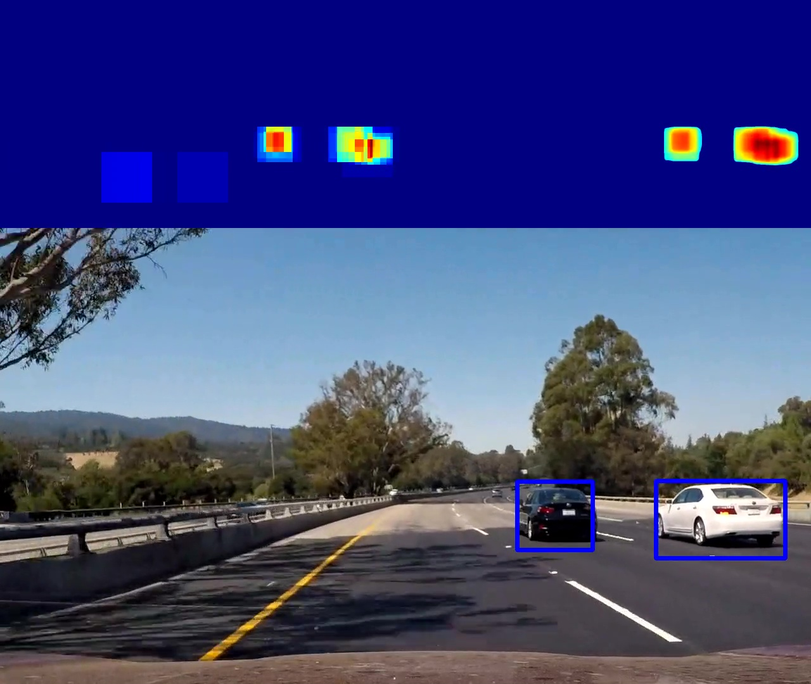

# ** Vehicle Detection *

This project is MaxEtzo's submission for **Vehicle Detection** aassignment which is a part of [**Self-Driving Car Engineer Nanodegree's**](https://eu.udacity.com/course/self-driving-car-engineer-nanodegree--nd013) by **Udacity**

The goals / steps of this project are the following:

* Perform a Histogram of Oriented Gradients (HOG) feature extraction on a labeled training set of images and train a classifier Linear SVM classifier
* Optionally, apply a color transform and append binned color features, as well as histograms of color, to your HOG feature vector. 
* Note: for those first two steps don't forget to normalize your features and randomize a selection for training and testing.
* Implement a sliding-window technique and use your trained classifier to search for vehicles in images.
* Run your pipeline on a video stream (start with the test_video.mp4 and later implement on full project_video.mp4) and create a heat map of recurring detections frame by frame to reject outliers and follow detected vehicles.
* Estimate a bounding box for vehicles detected.

## Rubric points.
Here I will consider the [rubric](https://review.udacity.com/#!/rubrics/513/view) points individually and describe how I addressed each point in my implementation.  

### Features: Spatial + Histogram of Oriented Gradients (HOG) + Color Histogram

##### Final settings:
* Spatial features: **24x24x3**
* HOG: **18 orientations**, **16x16 pixels per cell**, **1x1 cells per block** for each color channel
* Color histogram: **24 bins** for each color channel
* Colorspace: **YCrCb**

#### 1. Extraction of features from the training images

As a basis for features extraction functions/methods provided in video lessons with some adjustments were taken (see file "core_functions.py"). As examples of such adjustments:
* HOG features can be of any color channel combinations, not just 0, 1, 2 or 'ALL' (see lines 7-10, and 87-94)
* Color histogram range depends on color space. In particular, for colorspaces 'HSV' and 'HLS' the range for Hue is between 0 and 180.
* Note: data format of images is uint8 (0 to 255)

First, `car` and `noncar` images of both KITTI and GTI datasets are read using `glob` module. In order to *partially* avoid time-series problem of GTI dataset only every 4th car image is taken. As the result, `car` dataset contains 6673 images against 8986 of `noncar`. To avoid biasing towards `noncar` images, only random 6673 are chosen. The code for the aforementioned operations is contained in code cell 1 of "main" IPython notebook. Below are examples of a `car` and a `noncar` images:


In code cell 2 of the notebook, you can see a final choice of binned color, histogram of colors and HOG features. Final choice of colorspace fell on `YCrCb` for a reason that will be explained in further sections. `Y`, `Cr` and `Cb` channels for the example 'car' and 'noncar' images are as follows:


Below, you can see a visualization of the HOG on those channels with the parameters of `orientations=18`, `pixels_per_cell=(16,16)` and `cells_per_block=(1,1)`:


And last but not least, the histograms are: 


(there is no real reason in representing spatial binned color features). Code snippets responsible for feature extraction can be found in code cells 6 and 7 (with the core functions from `core_functions.py`).

#### 2. Final choice of features settings

I started with features setting provided in video lessons: 
* Spatial features: **32x32x3** (where 32x32 resized image dimensions, and 3 color channels)
* HOG: **9 orientations**, **8x8 pixels per cell**, **2x2 cells per block** for each color channel
* Color histogram: **32 bins** for each color channel
* Colorspace: **HSV**

Linear SVM trained on features set above does perform relatively well (test accuracy of >99%). Slight tweaking the settings above does not result in any distinguishable changes, i.e. delta in test accuracy is in the order of the noise. Mere different partitionings of training and test set results in similar order of delta.

Although, the performance is satisfactory the number of features is extremely high - **8460**, and as the result so is computational and memory requirements for both training and the image processing pipeline. The goal was to reduce number of features without compromising the performance.

Removing any of the three feature classes (spatial, HOG or histogram), immediately resulted in substantial accuracy drop (up to ~5%) as well as in visible performance fails of pipeline, in terms of increased number of false negatives or false positives (when applied on test images). 

The strategy was to slowly reduce number of histogram bins (32 -> 24), spatial features size (32x32 -> 24x24), and hog feature size, while monitoring the effect both in terms of test accuracy and the visual performance of image processing pipeline. Reducing HOG feature size is not a trivial task. Since original images are of 64x64 resolution pixel_per_cell can only be a power of 2, i.e. pix_per_cell can only be increased by factor of 2x2: from 8x8 to 16x16. Alternatively, original images can be scaled/resized to a different resolution, e.g. 60x60 and the pix_per_cell can be chosen as either 10x10 or 12x12. I found impracticle to scale/resize all training and test images and instead went with the former approach. As cell size increased to 16x16, I could also reduce cells_per_block number to 1. In order to partially compromise such a dramatic change of cell numbers per image, I increased number of histogram bins from 9 to 18. 

I tried out multiple colorspace, however, many of them have demonstrated bias (hotter regions in heatmap) towards either dark/black or bright/white cars (as in test images). Surprisingly, `YCrCb` has shown the least of such bias. 

All in all, I managed to reduce number of features to **2664** (~x3 less) and still stay in **99% test accuracy** region.

#### 3. Training a linear classifier

Before training linear SVM, I used `StandardScaler` to normalize the features and split dataset into `training` and `test` in ratio of 8:2. It took 7.19 seconds to train linear SVM and test accuracy of 0.9925 was achieved. Code can be found in code cells 7 and 8.

### Sliding Window Search
The core sliding window search function is called `car_heatmap`, and can be found in code cell 11, which returns heatmap (and not bounding boxes as suggested in video lessons). 

#### 1. Sliding window search: window sizes, y-limits, overlaps.

After multiple iterations, I stopped on the following choice of window sizes:
```python
window_size = [160, 112, 80, 64]
```
For the sake of beauty as well as optimization, in reality `window_size` was kept the same, and instead the complete image was scaled appropriately. Corresponding scale factors are as follows:
```python
scale = [2.5, 1.75, 1.25, 1.0]
```
Clearly, the limits in y-dimensions depend on the window size. For example, we do not expect to see a really small car projection in close proximity (i.e. y coordinates close to the bottom). Also, we do not expect to see any car in the sky (unless flying cars, thanks to another Udacity program, really kick in!). In general, as `window_size` gets smaller y-limits converge to horizon. 
```python
y_min = [400, 400, 400, 400]
y_max = [640, 568, 520, 496]
```
As of overlap, due to the optimization (global hog estimation, see below) the biggest overlap that my choice of `pix_per_cell` of 16x16 allows is 0.75:
```python
xy_overlap  = [(0.75, 0.5), (0.75, 0.75), (0.75, 0.75), (0.75, 0.75)] 
```
Why the window size of 160 has a y overlap of 0.5? I just felt like it. 


#### 2. Global HOG optimization (and why not spatial and histogram of color features):
In order to optimize performance, on each scale (i.e. for different window sizes, see above), first global HOG is estimated on cropped image (based on y-limits) and HOG features for each window are sampled as pipeline progresses. I wrote a similar implementations for spatial and histogram of colors features, but they did not result in any performance boost. Global histogram of colors was estimated in a similar way as HOG by introducing histogram cells based on overlapping factor. However, stupid me later realized that amount of histogram operations did not reduced at all, but additional memory costs were added for storing all the histograms for individual cells. As for spatial features, resizing a complete image once or individual windows apparently does not make a big difference due to cheapness of the operation in the first place.

#### 3. L2 floating heatmap via `clasifier.decision_function`:
One of the **best decision** I have made was to switch from `classifier.predict()` to `classifier.decision_function`. Output of `predict` is highly compressed data as information about *confidence level* is absolutely lost. Instead, in my implementation the heatmap is constructed based on confidence level given by `decision_function` method. Another nice feature, is that **hyperplane can be artificially moved up or down**! For example, if you want the algorithm to be more robust against false-positives, raise confidence threshold above 0.0. In contrast, if you want the algorith to pick up a weaker signals, lower confidence threshold below 0.0 (do not forget to subtract threshold from a confidence level back!). Extremely important is to adjust your postprocessing (for example, final heatmap thresholding) according to your confidence threshold. After playing a bit with a hyperplane, I decided to leave at 0.0 for now, although I see potential use-cases for changing it. 

Final heatmap is a sum of squares of confidence levels. Heatmap pre-processing step includes taking square root of the heatmap, sort of L2 normalization. Reason it is not performed in `car_heatmap` method is because by returning heatmaps squared you can sum heatmaps across multiple frames for a video pipeline.

#### 4. Heatmap thresholding (hard + otsu) on interpolated heatmap
`threshold_otsu` is a very powerful adaptive thresholding algorithm. The advantage of the otsu is that it adapts to the noise floor, but the downsight is that in case there is no *real* signal, individual noise spikes are counted as a signal. By combining, `threshold_otsu` with hard threshold overall performance can be improved. 

`heatmap_threshold` is applied on preprocessed heatmap (code cell 12) that includes taking square root of it (L2 normalization, see above) as well as applying `GaussianBlur`. Gaussian blurring is one way to interpolate heatmap values between discrete windows!

#### 5. Results on test images:
On the left you can see final heatmaps (after preprocessing and thresholding) and on the right resulting bounding boxes (based on `scipy.ndimage.measurements.label()` method).


### Video Implementation

Video processing pipeline can be found in code cell 14. 

#### 1. Provide a link to your final video output.  Your pipeline should perform reasonably well on the entire project video (somewhat wobbly or unstable bounding boxes are ok as long as you are identifying the vehicles most of the time with minimal false positives.)
Here's a [link to my video result](./project_video_output.mp4)

#### 2. Infinite impulse response filter

Instead of averaging across multiple frames I implemented infinite impulse response filter for it's computational and memory cheapness and elegance (although finite impulse response is for obvious reasons is a better choice). The decay factor of choice is 0.2. IIR results in *smoother* bounding boxes dynamics.

#### 3. Spatio-Temporal Correlation

Every now and then (when stars align), a really strong false positive appears on the heatmap. Unfortunately, IIR is not able to deal with such cases. In order to avoid such false positives, an additional filter of Spatio-Temporal Correlation is implemented. Spatio-Temporal Correlation means that a heatmap value for a single pixel (spatial correlation) is considered when it is confirmed across multiple frames (temporal correlation). Number of frames can be set arbitrarily, but I have chosen 3. Basic implementation is taking a minimum values across last 3 heatmaps (I call it floating equivalent of logical AND). In such way, instanteneous noise spikes that only last for 1 or 2 frames are filtered out. 

#### 4. Example:
Below is an example of *instant* heatmap (top-left) and *integrated/filtered* heatmap (top-right) with a resulting bounding boxes:



### Discussion

#### 1. Briefly discuss any problems / issues you faced in your implementation of this project.  Where will your pipeline likely fail?  What could you do to make it more robust?

In general, any low pass filters such as IIR or Spatio-Temporal correlation that we used adds a delay / latency. This is a highly unwanted effect in dynamic and safety critical environment such as automotive. In our case, Spatio-Temporal correlation across 3 frames results in a delay of 2 frames, so IIR approximately of 3-4, totaling in approx. 5-6 frame delay. This can be clearly observed when on one occasion a bounding box of a car in the opposite lane appeared with a delay. Also, a car in the end of the video (SUV) was not recognized in time. Changing decay factor of IIR from 0.2 to 0.3 or above gives enough time of SUV to be recognized, but also results in more false-positive noise.

It can be seen that Spatio-Temporal correlation and IIR are not effective to eliminate all false-positives, as certain noise spikes last for more than 3-5 frames. More advanced *predictive!* filters, such as Kalman filter must be applied to avoid aforementioned challenges. (it will also help to more correctly identify bounding boxes).

Another disadvantage is that bounding boxes are not confining a car, but rather inside due to thresholding (edges of a car fall under threshold). This can be avoided by applying a more advanced thresholding algorithm based on local noise estimate (such as CFAR) + predictive filters such as Kalmann.

And last but not least, `scipy.ndimage.measurements.label()` does a poor job of discriminating two different objects. In certain video segments (around 35s) two clear heatmap peaks can be identified (hence two cars can be discriminated), however `scipy.ndimage.measurements.label()` labels them as one since they are touching.

